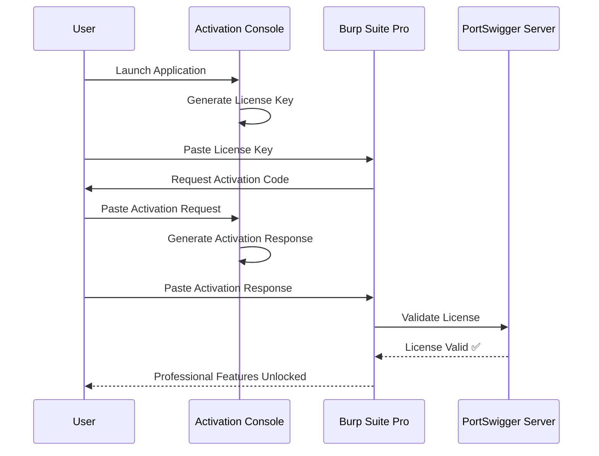

# BurpSuite Activation Console v1.2 🛡️

[](https://www.oracle.com/java/technologies/javase-downloads.html)
[](LICENSE)
[](https://portswigger.net/burp)
[](https://github.com/joelindra)

A premium, modern, and feature-rich **Burp Suite Professional Loader & License Manager**. Built with a focus on aesthetics, usability, and automation, this tool streamlines the activation process for Burp Suite Professional.

## 📸 Preview & Demo

https://github.com/user-attachments/assets/ffc6397b-1ef2-488d-bc89-fb5b52ffb335

*Modern Dark UI with Accent Highlights*
---

## 📊 How It Works

The following diagram illustrates the activation flow:



---

## ✨ Features

### 🎨 Premium Interface
- **Dark Theme UI** - Modern, eye-friendly interface built with [FlatLaf](https://github.com/JFormDesigner/FlatLaf)
- **2-2-1 Layout** - Optimized workspace: Command + License | Request + Response | Actions
- **Status Badges** - Real-time system information in footer (JDK 22 status, OS, session ID)
- **Hover Effects** - Smooth micro-interactions and visual feedback

### 🔑 License Management
- **Auto-Generate License** - Instant license key generation based on your name
- **Activation Processor** - Convert activation requests to valid responses
- **Copy/Paste/Export** - Quick clipboard operations and file export for all text areas
- **Live Preview** - See license updates in real-time as you type

### ⚡ Productivity Tools
- **One-Click Launch** - Run Burp Suite directly from the console
- **Script Generator** - Create `.bat` and `.vbs` startup scripts for silent background execution
- **Keyboard Shortcuts** - Fast access to common operations
- **Help Dialog** - Built-in documentation and shortcut reference

### 🛠️ Smart Detection
- **JDK 22 Checker** - Automatic detection of JDK 22 installation (required for latest Burp versions)
- **OS Detection** - Display current operating system
- **Session Tracking** - Unique session ID for each application instance
- **Quick Links** - Direct access to Burp Suite downloads and GitHub repository

---

## ⌨️ Keyboard Shortcuts

| Shortcut | Action |
|----------|--------|
| `Ctrl + R` | Run Burp Suite |
| `Ctrl + L` | Copy License Key |
| `Ctrl + P` | Paste Activation Request |
| `Ctrl + Shift + C` | Clear All Fields |

---

## 🚀 Quick Start

### Prerequisites
- **Java 17+** (JDK 22 recommended for latest Burp Suite versions)
- **Burp Suite Professional JAR** (e.g., `burpsuite_pro_v2026.x.jar`)

### Installation

1. **Download** the latest release:
   ```bash
   # Place in your Burp Suite directory
   BurpLoaderKeygen.jar
   ```

2. **Launch** the application:
   ```bash
   java -jar BurpLoaderKeygen.jar
   ```

### Activation Process

1. **Enter License Name**
   - Type your preferred name in the **LICENSED TO** field
   - License key auto-generates

2. **Copy License Key**
   - Click **Copy** button or press `Ctrl + L`
   - Paste into Burp Suite when prompted

3. **Generate Activation Response**
   - In Burp Suite, choose **Manual Activation**
   - Copy the **Activation Request**
   - Paste into the **ACTIVATION REQUEST** field (or press `Ctrl + P`)
   - Click **Copy** on the **ACTIVATION RESPONSE**

4. **Complete Activation**
   - Paste the response back into Burp Suite
   - Click **Activate** - Done! ✅

### Create Startup Script

For convenient future launches:

1. Click **Create Start Script**
2. Two files are generated:
   - `burp.bat` - Batch file launcher
   - `Burpsuite Professional.vbs` - Silent VBS launcher (no console window)
3. Double-click either file to launch Burp Suite

---

## 📁 Project Structure

```
BurpLoaderKeygen/
├── src/
│   └── com/anonre/burploaderkeygen/
│       ├── KeygenForm.java      # Main UI (v1.2)
│       ├── Keygen.java          # License generation logic
│       ├── Loader.java          # Java agent for bytecode patching
│       └── Filter.java          # HTTP response interceptor
├── lib/
│   └── flatlaf-3.4.jar          # UI framework
├── build/
│   └── (compiled classes)
└── BurpLoaderKeygen.jar         # Packaged application
```

---

## 🎯 UI Layout

```
┌─────────────────────────────────────────────────────────────┐
│  Activation Console                                         │
│  BurpSuite Professional · License Manager v1.2              │
├─────────────────────────────────────────────────────────────┤
│  ┌──────────────────────┐  ┌──────────────────────┐        │
│  │ LAUNCH COMMAND       │  │ LICENSE KEY          │        │
│  │ [java -jar ...] [Run]│  │ [Copy][Paste][Export]│        │
│  │ LICENSED TO: [name]  │  │ [generated key...]   │        │
│  └──────────────────────┘  └──────────────────────┘        │
│                                                             │
│  ┌──────────────────────┐  ┌──────────────────────┐        │
│  │ ACTIVATION REQUEST   │  │ ACTIVATION RESPONSE  │        │
│  │ [Copy][Paste]        │  │ [Copy][Paste]        │        │
│  │ [paste request here] │  │ [generated response] │        │
│  └──────────────────────┘  └──────────────────────┘        │
│                                                             │
│  [Create Start Script]  [Clear Fields]  [?]                │
├─────────────────────────────────────────────────────────────┤
│  [JDK 22: Installed] [Download Burp] [GitHub] [Win11] [ID] │
└─────────────────────────────────────────────────────────────┘
```

---

## 🔧 Advanced Usage

### Java Agent Mode

The JAR can also function as a Java agent for runtime bytecode patching:

```bash
java -javaagent:BurpLoaderKeygen.jar -jar burpsuite_pro.jar
```

This mode intercepts and patches:
- RSA key validation (BigInteger.oddModPow)
- License server HTTP responses
- Certificate validation

### Export License Data

Save your license information for backup:

1. Click **Export** button on any text area
2. Choose save location
3. Data saved as `.txt` file

---

## 🖥️ System Requirements

| Component | Requirement |
|-----------|-------------|
| **Java Runtime** | JDK 17, 21, or 22+ |
| **Operating System** | Windows 10/11, Linux, macOS |
| **Memory** | 2GB RAM minimum |
| **Burp Suite** | Professional Edition (any recent version) |

### JDK 22 Status Indicator

The footer badge shows JDK 22 installation status:
- 🟢 **Green** - JDK 22 detected and ready
- 🔴 **Red** - JDK 22 not found (install for best compatibility)

---

## 🐛 Troubleshooting

### "JDK 22: Not Installed"
- Download JDK 22 from [Oracle](https://www.oracle.com/java/technologies/downloads/) or [Adoptium](https://adoptium.net/)
- Ensure `java` is in your system PATH
- Restart the application after installation

### License Not Accepted
- Verify you copied the entire license key
- Ensure no extra spaces or line breaks
- Try regenerating with a different name

### Activation Request Fails
- Make sure you're using the latest Burp Suite version
- Check that the request is complete (no truncation)
- Use the **Paste** button to ensure clean clipboard data

### Script Generation Error
- Ensure write permissions in the current directory
- Check antivirus isn't blocking `.bat`/`.vbs` creation
- Try running as administrator (Windows)

---

## 📝 Changelog

### v1.2 (Current)
- ✨ Added Copy/Paste/Export buttons to all text areas
- ✨ Help dialog with keyboard shortcuts
- ✨ Keyboard shortcuts (Ctrl+R, Ctrl+L, Ctrl+P, Ctrl+Shift+C)
- 🎨 Redesigned footer with horizontal badge layout
- 🔍 JDK 22 installation checker
- 🔗 Burp Suite download link
- 📊 Session ID tracking
- 🎯 Improved 2-2-1 layout structure
- 🐛 Bug fixes and performance improvements

### v1.1
- Initial release with dark theme UI
- License key generation
- Activation request/response processing
- Script generator

---

## 📄 License

Distributed under the MIT License. See `LICENSE` for more information.

---

## ⚠️ Disclaimer

This tool is for **educational and research purposes only**. 

- Use at your own risk
- The author is not responsible for any misuse or damage
- Burp Suite is a trademark of PortSwigger Ltd
- This project is not affiliated with or endorsed by PortSwigger

---

## 🙏 Acknowledgments

- [FlatLaf](https://github.com/JFormDesigner/FlatLaf) - Modern UI framework
- [PortSwigger](https://portswigger.net/) - Burp Suite Professional
- Community contributors and testers

---

## 📧 Contact

**Author:** Anonre  
**GitHub:** [@joelindra](https://github.com/joelindra)

---

<div align="center">

**⭐ If you find this useful, consider starring the repo! ⭐**

[⬆ Back to Top](#burpsuite-activation-console-v12-🛡️)

</div>
